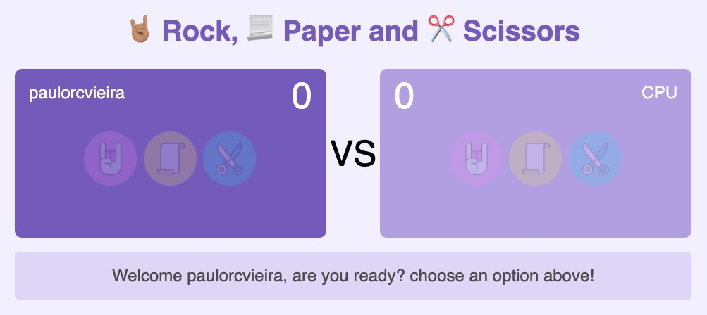
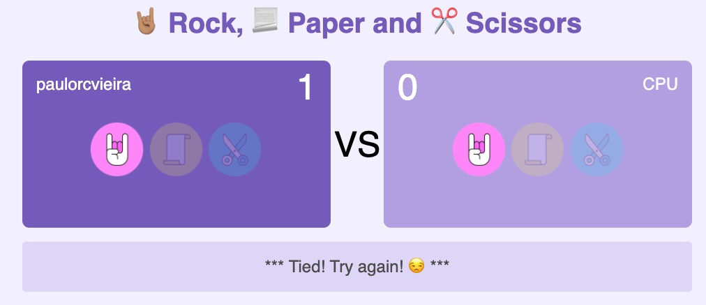
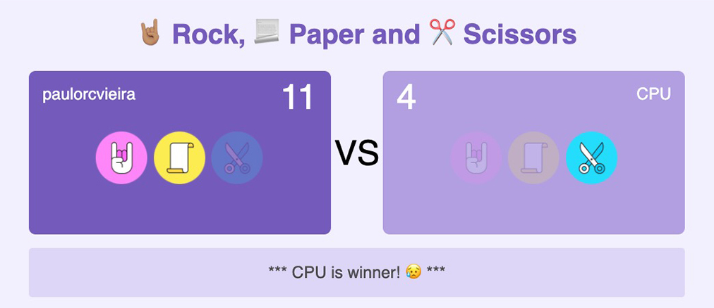

<h1 align="center">Welcome to Jokenpô Game</h1>

<h1 align="center">🤘🏽 Rock, 📃 Paper and ✂️ Scissors</h1>

<p>
  

  <a href="https://github.com/paulorcvieira/jokenpo-game/graphs/commit-activity" target="_blank">
    
  </a>
</p>


> 🤘🏽 Simple Game (html/CSS/JS) - Jokempô is a simple and recreational hand game that requires no equipment or skill.


### 🏠 [Homepage](https://github.com/paulorcvieira/jokenpo-game/blob/master/README.md)


## Start

```sh
Open and start **jokenpo.html**
```

## Screenshot





---

## Author

👤 **Paulo Vieira**

* Twitter: [@paulorcvieira](https://twitter.com/paulorcvieira)
* Github: [@paulorcvieira](https://github.com/paulorcvieira)
* LinkedIn: [@paulorcvieira](www.linkedin.com/in/paulorcvieira)

---

## 📝 License

Copyright © 2020 [Paulo Vieira](https://github.com/paulorcvieira).<br />
This project is [MIT](https://github.com/paulorcvieira/jokenpo-game/blob/master/LICENSE.md) licensed.